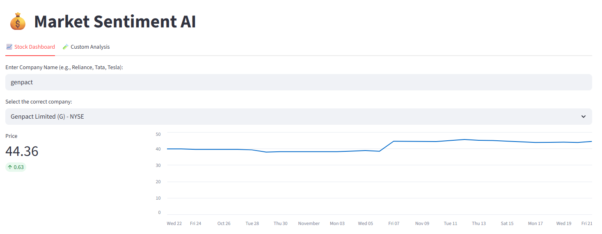
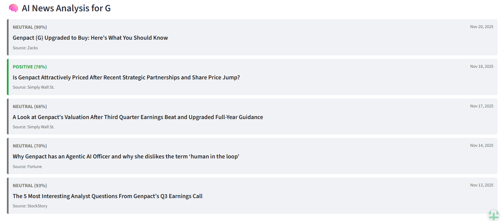

# 💰 Market Sentiment AI

[](https://ashish-market-sentiment-ai.streamlit.app/)
[](https://www.python.org/)
[](https://huggingface.co/ProsusAI/finbert)

A real-time financial dashboard that analyzes stock news sentiment using **FinBERT** (a Financial Large Language Model). Built to help traders make data-driven decisions by cutting through the noise of market news.

## Live Demo
**[Click here to use the App](https://ashish-market-sentiment-ai.streamlit.app/)**

---

## Key Features

* **Real-Time Market Data:** Fetches live stock prices and historical trends for companies listed on **NSE** (India), **BSE**, and **NASDAQ** (USA).
* **AI-Powered Analysis:** Uses `ProsusAI/finbert` to analyze news headlines and classify sentiment as **Positive**, **Negative**, or **Neutral**.
* **Smart Ticker Search:** Auto-detects correct stock tickers (e.g., converts "Reliance" to "RELIANCE.NS") using Yahoo Finance API.
* **Custom Text Analyzer:** Allows users to paste any financial article or report to get an instant AI sentiment score.
* **Bulletproof Error Handling:** Automatically handles missing data, API timeouts, and rate limits without crashing.

---

## Tech Stack

* **Frontend:** Streamlit
* **Backend:** Python 3.10+
* **AI Model:** Hugging Face Inference API (FinBERT)
* **Data Provider:** Yahoo Finance (`yfinance`)
* **Deployment:** Streamlit Community Cloud

---

##  Screenshots

### 1. Stock Dashboard (Real-time Charts & News)


### 2. AI Analysis (Sentiment Scoring)


---

## ⚙️ How to Run Locally

1. **Clone the repository**
   ```
   git clone https://github.com/physiokirar/market-sentiment-ai.git
   cd market-sentiment-ai

   ---

**Created by [Ashish Kumar Kirar](https://www.linkedin.com/in/ashishkumarkirardataenthu)**